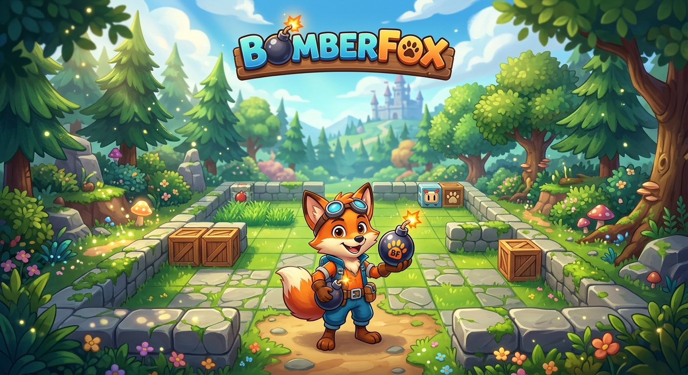

<a id="readme-top"></a>

<!-- PROJECT SHIELDS -->
<div align="center">

[![Issues][issues-shield]][issues-url]
[![license][license-shield]][license-url]
[![LinkedIn][linkedin-shield]][linkedin-url]

</div>

<br />

<div align="center">

<a href="https://github.com/MattheusMorais/bomberfox">

</a>

# 🦊 BomberFox

Um jogo de ação em 2D inspirado no clássico Bomberman, desenvolvido em **Python** utilizando **Tkinter**. O projeto foi criado para explorar conceitos de desenvolvimento de jogos, programação orientada a objetos, gerenciamento de estados, colisão entre entidades e renderização em tempo real.

Embora inspirado em Bomberman, o foco do projeto está na implementação da lógica do jogo, organização do código e arquitetura da aplicação.

<br />

<a href="https://github.com/MattheusMorais/bomberfox/issues">Reportar Bug</a>

</div>

---

# 📖 Sobre o Projeto

**BomberFox** é um jogo em 2D onde o jogador controla uma raposa que deve navegar por um mapa repleto de obstáculos utilizando bombas para abrir caminho e eliminar inimigos.

O projeto foi desenvolvido com Python e Tkinter, utilizando o Canvas como mecanismo de renderização para sprites, animações e atualização contínua da cena.

Durante o desenvolvimento foram aplicados conceitos como:

- Programação Orientada a Objetos
- Gerenciamento de entidades
- Loop principal do jogo
- Sistema de colisões
- Controle de movimentação
- Sistema de bombas e explosões
- Atualização em tempo real da interface
- Organização modular do código

<div align="center">


</div>

---

# 🛠️ Tecnologias

<div align="center">

![Python][Python]
![Tkinter][Tkinter]

</div>

---

# ✨ Funcionalidades

- 🎮 Movimentação em quatro direções
- 💣 Sistema de bombas
- 💥 Explosões em múltiplas direções
- 🧱 Blocos destrutíveis
- 🪨 Obstáculos fixos
- 👾 Inimigos
- ❤️ Sistema de Status
- 🏆 Pontuação
- 🔄 Reinício de partida
- 🦊 Personagem personalizado (Fox)

---

# 🏗️ Arquitetura

O projeto foi organizado de forma modular para facilitar manutenção e evolução.

Estrutura geral:

```
Game
│
├── Player
├── Enemy
├── Bomb
├── Explosion
├── Map
├── Collision
├── Game Loop
└── Tkinter Canvas
```

Cada componente possui responsabilidades específicas, reduzindo acoplamento e facilitando futuras expansões do jogo.

---

# 🎮 Mecânicas

Durante a partida o jogador pode:

- explorar o mapa;
- posicionar bombas;
- destruir blocos;
- eliminar inimigos;
- evitar explosões;
- concluir o mapa sobrevivendo aos desafios.

As explosões propagam em quatro direções, respeitando obstáculos do cenário e afetando jogadores e inimigos.

---

# 🚀 Começando

## Pré-requisitos

- Python 3.10+

Clone o projeto

```bash
git clone https://github.com/MattheusMorais/bomberfox.git
```

Entre na pasta

```bash
cd bomberfox
```

Execute

```bash
python main.py
```

---

# 🎮 Controles

| Tecla | Ação |
|--------|------|
| ↑ ↓ ← → | Movimentação |
| Espaço | Posicionar bomba |

---

# 📂 Organização

```
BomberFox/

assets/
sprites/
maps/

game/
player.py
enemy.py
bomb.py
explosion.py
collision.py
map.py

main.py
```

---

# 🚧 Roadmap

- [ ] Power-ups
- [ ] Novos mapas
- [ ] Sons e músicas
- [ ] Sistema de fases
- [ ] Sistema de recordes
- [ ] Animações aprimoradas

---

# 📄 Licença

Distribuído sob a licença MIT.

Veja `LICENSE` para mais informações.

---

# 🤝 Contato

**Matheus Morais**

LinkedIn:
https://www.linkedin.com/in/mattheus-morais/

Email:
moraism.dev@gmail.com

Projeto:
https://github.com/MattheusMorais/bomberfox

Site:
https://matheus-morais.vercel.app/

<p align="right">(<a href="#readme-top">voltar ao topo</a>)</p>

<!-- LINKS -->

[issues-shield]: https://img.shields.io/github/issues/MattheusMorais/bomberfox.svg?style=for-the-badge
[issues-url]: https://github.com/MattheusMorais/bomberfox/issues

[license-shield]: https://img.shields.io/github/license/MattheusMorais/bomberfox.svg?style=for-the-badge
[license-url]: https://github.com/MattheusMorais/bomberfox/blob/main/LICENSE

[linkedin-shield]: https://img.shields.io/badge/-LinkedIn-black.svg?style=for-the-badge&logo=linkedin&colorB=555
[linkedin-url]: https://www.linkedin.com/in/mattheus-morais/

[Python]: https://img.shields.io/badge/Python-3776AB?style=for-the-badge&logo=python&logoColor=white

[Tkinter]: https://img.shields.io/badge/Tkinter-GUI-blue?style=for-the-badge

OBS: Instalar as dependencias de lib externas para conseguir rodar o programa -> pip install -r requirements.txt
